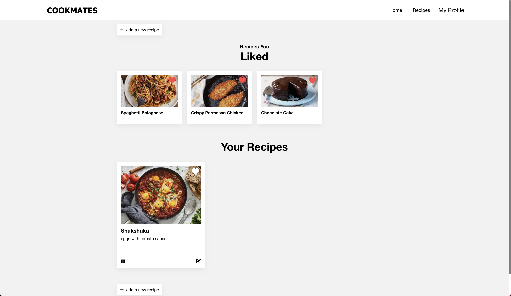

# Cookmates Frontend

Welcome to the Cookmates frontend repository! This is a frontend web application for cooking enthusiasts to share recipes and connect with other cooks.

### Live Demo:
https://idoperi104.github.io/Cookmates-frontend/#/

## Table of Contents

- [Features](#features)
- [Technologies Used](#technologies-used)
- [Screenshots](#screenshots)
- [Getting Started](#getting-started)

## Features

Cookmates frontend includes the following features:

- User authentication and authorization
- Ability to create and edit recipes
- Ability to search for recipes by keyword
- Ability to view other users' profiles and recipes
- Responsive design for mobile and desktop devices

## Technologies Used

This project was built using the following technologies:

- React
- Redux
- Scss
- cloudinary

## Screenshots

### Home Page

### Recipes Page

### Profile Page

## Getting Started

To get started with the Cookmates frontend, follow these steps:

1. Clone the repository to your local machine.
2. Install the necessary dependencies by running `npm install`.
3. Start the development server with `npm start`.
 
